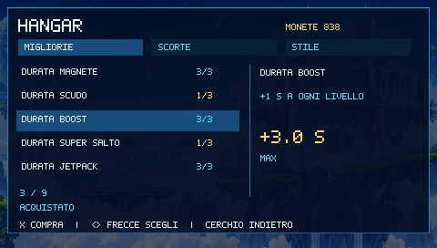
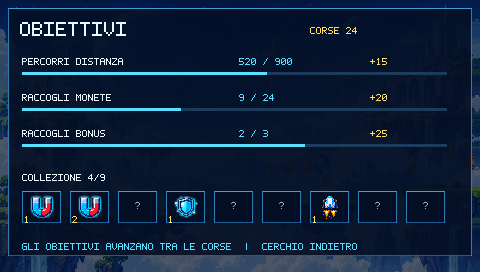

# Sky Hopper PSP — Oltre le Nuvole

[English](README.md) · [Guida allo sviluppo](docs/DEVELOPMENT.md) ·
[Mappa completa del progetto](docs/PROJECT_MAP.md)

Repository: [Danyele360/sky-hopper-psp](https://github.com/Danyele360/sky-hopper-psp)


Un platform infinito originale per **PlayStation Portable**, scritto in Rust.
Corri sulle isole sospese, salta e usa il dash, raccogli monete e prepara le
corse successive con potenziamenti permanenti, capsule e obiettivi.

Sono inclusi **sorgenti, grafica originale e runtime, animazioni, strumenti,
documentazione, test e screenshot**. La licenza dei materiali originali è
**[MIT](LICENSE)**; le dipendenze mantengono le proprie licenze e attribuzioni.

## Funzioni

- Panoramica all'80%, risoluzione 480 × 272 e HUD compatto con timer individuali.
- Doppio salto, dash, piattaforme mobili, rampe, molle, droni e ostacoli.
- Magnete, scudo, boost, super salto, jetpack e slow motion. I bonus compatibili
  coesistono; boost e jetpack si sostituiscono. Il super salto resta in attesa
  con timer sospeso durante il volo.
- Livelli permanenti della durata dei bonus, raggio magnete, recupero dash e
  guadagno delle monete.
- Capsule accumulabili: scegli un bonus iniziale, consumando una sola capsula.
- Obiettivi che avanzano tra le corse, nove elementi di collezione e aspetti
  sbloccabili per robot e cielo.
- Interfaccia **ITA/ENG**, salvataggi locali, sprite animati ed effetti audio.

| Gameplay | Tema Nebula |
| --- | --- |
|  |  |

| Hangar | Obiettivi |
| --- | --- |
|  |  |

[Vetrina completa](docs/showcase/README.md). Le nuove immagini sono catture
reali della PSP 0.2 in PPSSPP, con un profilo dimostrativo separato e risorse
predisposte per mostrare le funzioni.

## Stato e avvio

La **PSP 0.2** è compilata e verificata in PPSSPP 1.20.4. Sono stati superati
30 test Rust e 22 test JavaScript; i controlli comprendono menu, lingua,
input, pausa, HUD e migrazione dei salvataggi. La nuova versione non ha ancora
misurazioni su hardware reale. [Dettagli](docs/psp-v0.2/NOTE.md).

La **WASM inclusa è la precedente versione giocabile**. Compilala nuovamente
per usare il Rust attuale nel browser. `preview/camera.html` mostra il design
aggiornato attraverso modelli JavaScript, senza eseguire la fisica Rust.

**Scarica PSP v0.2:** [ZIP installabile](https://github.com/Danyele360/sky-hopper-psp/releases/download/v0.2/SkyHopper-PSP-v0.2.zip)
· [EBOOT per PPSSPP](https://github.com/Danyele360/sky-hopper-psp/releases/download/v0.2/SkyHopper.EBOOT.PBP)
· [Note della release](https://github.com/Danyele360/sky-hopper-psp/releases/tag/v0.2).

Per PSP, compila o scarica lo ZIP della release:
estrailo nella Memory Stick ottenendo `PSP/GAME/SKYHOPPER/EBOOT.PBP` e avvialo
su una console predisposta per homebrew. In PPSSPP apri il file autonomo
`dist/SkyHopper.EBOOT.PBP`, per evitare che un percorso `PSP/GAME` esterno
venga risolto contro una vecchia copia nella Memory Stick dell'emulatore.

Per provare nel browser la WASM inclusa:

```sh
python tools/preview_server.py
```

Su Linux/macOS usa `python3`. Apri `http://127.0.0.1:8787/preview/`.
Su Windows puoi usare `Avvia-Anteprima.cmd`. Non aprire l'HTML direttamente.

| Azione | PSP | Browser |
| --- | --- | --- |
| Salto / doppio salto | X | Spazio / X |
| Traiettoria | Frecce / analogico | Frecce / A / D |
| Dash | L / R | Q / E |
| Pausa | START | Invio / P |
| Indietro | Cerchio | Esc / C |
| Jetpack: sali / scendi | X o su / giù | Spazio o su / giù |

Nell'hangar, su/giù sceglie la voce, sinistra/destra cambia categoria, X compra
o equipaggia un aspetto; L/R sceglie la capsula iniziale. Il salvataggio PSP è
`sky-hopper-save.bin` accanto al gioco: conservalo durante gli aggiornamenti.
Una corsa salva al termine o tornando al menu dalla pausa. Acquisti, lingua e
capsule salvano quando cambiano. I salvataggi browser e delle verifiche sono
separati da quelli PSP.

## Compilazione

Servono Git, Rustup, Python 3.11+ e gli strumenti di compilazione del sistema.
La compilazione verificata usa Linux/Ubuntu in WSL2. Sono fissati
**nightly-2026-04-13** e il commit SDK
**ad92131218406308170a3344786865415aef2995**.

```sh
rustup toolchain install nightly-2026-04-13 --profile minimal --component rust-src --component rustfmt --target wasm32-unknown-unknown
cargo +nightly-2026-04-13 install --git https://github.com/AndrewAltimit/rust-psp --rev ad92131218406308170a3344786865415aef2995 cargo-psp --locked
bash tools/build.sh psp
```

Il comando esegue i test, compila PSP e prepara in `dist/` il pacchetto con le
licenze. Gli asset runtime sono inclusi: non serve rigenerare le immagini.
`bash tools/build.sh wasm` ricompila solo il browser; `all` compila entrambi.
Su Windows usa `Compila-PSP.ps1 -Target psp`, `wasm` oppure `all`; se Cargo non
è installato localmente, lo script usa Ubuntu in WSL.

Setup completo e problemi comuni: [DEVELOPMENT.md](docs/DEVELOPMENT.md).

## Orientarsi nel progetto

`crates/game` contiene simulazione, progressione e renderer condivisi;
`crates/psp` e `crates/wasm` li collegano alle due piattaforme.
`assets/source` contiene le immagini generate, `assets/runtime` le texture e
il font incorporati, `assets/animations` le GIF dimostrative.
I JSON in `assets` controllano bonus, economia, catalogo e traduzioni.
`preview` contiene il giocatore browser e i modelli di verifica; `tools`
contiene tutti gli strumenti; `docs` spiega sviluppo, architettura, grafica,
scelte di design e risultati. Le licenze delle dipendenze sono in `LICENSES`.

- [Mappa delle cartelle e di ogni strumento](docs/PROJECT_MAP.md)
- [Architettura e salvataggi](docs/ARCHITECTURE.md)
- [Grafica, pose e animazioni](docs/ASSETS.md)
- [Come contribuire](CONTRIBUTING.md)
- [Come pubblicare e distribuire il progetto](docs/PUBLISHING.md)

Il pacchetto sorgente include il progetto completo; cache di compilazione,
emulatori scaricati, dipendenze installate e salvataggi personali restano
locali. `python tools/package_source.py` genera lo ZIP pubblico e il manifest
dei file. I binari PSP vanno nelle release, mentre `.gitignore` esclude `dist`.

## Licenze e crediti

Codice, documentazione e materiali originali del progetto sono MIT.
Le immagini sono state generate usando il concept visivo fornito, poi
trasformate in atlanti runtime; originali e prompt sono inclusi.
L'audio è sintetizzato dal codice. [Provenienza](docs/ASSETS.md).

SDK: [rust-psp](https://andrewaltimit.github.io/rust-psp/).
Attribuzioni e licenze delle dipendenze:
[THIRD_PARTY_NOTICES.md](THIRD_PARTY_NOTICES.md).
