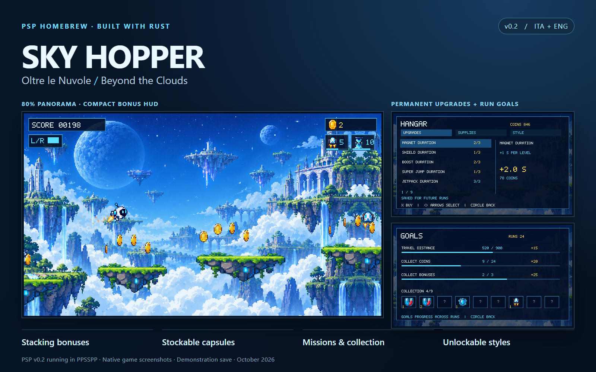
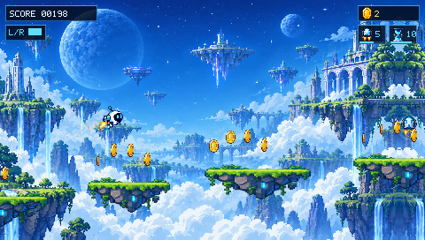
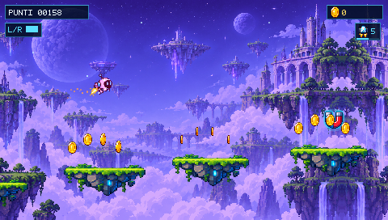
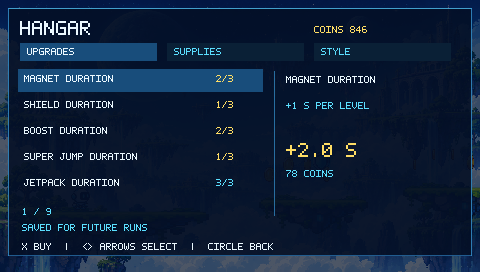
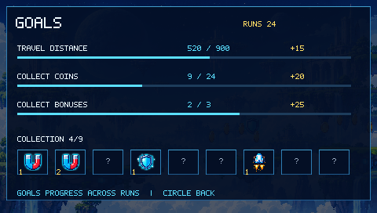

# Sky Hopper PSP — Beyond the Clouds

[Italiano](README.it.md) · [Development guide](docs/DEVELOPMENT.md) ·
[Project map](docs/PROJECT_MAP.md) · [Contributing](CONTRIBUTING.md)

Repository: [Danyele360/sky-hopper-psp](https://github.com/Danyele360/sky-hopper-psp)



An original endless platformer for the **PlayStation Portable**, built in Rust.
Run across floating islands, jump and dash above the clouds, collect coins,
and improve your next attempt through lasting upgrades and run goals.

This repository includes the game source, graphics, animation previews,
browser tools, build scripts and verification records. Original project
materials are released under the **[MIT license](LICENSE)**. Dependencies
retain their licenses; see [third-party notices](THIRD_PARTY_NOTICES.md).

## What's in the game

- **80% panoramic view**, native 480 × 272 rendering and a compact bonus HUD.
- Double jump, dash, springs, moving platforms, spikes, drones and coins.
- Six bonuses: magnet, shield, boost, super jump, jetpack and slow motion.
  Compatible effects stack. Boost and jetpack replace each other; super jump
  waits with its timer suspended while jetpack is active.
- Permanent bonus-duration levels, magnet range, dash cooldown and coin yield.
- Stockable capsules: equip one starting bonus and consume one capsule per run.
- Missions that progress between runs, nine collection items and cosmetic unlocks.
- **Italian / English**, switchable from the game menu; local persistent saves.
- Animated robot sprites, particles, background motion and synthesized audio.

| Gameplay | Nebula robot and sky |
| --- | --- |
|  |  |

| Permanent upgrades | Goals and collection |
| --- | --- |
|  |  |

[Browse all current screenshots](docs/showcase/README.md). They show the PSP
0.2 executable in PPSSPP 1.20.4 with an isolated demonstration save;
resources and unlocks were staged for presentation.

## Current status

**PSP 0.2** was built and verified in PPSSPP, including boot, inputs, menus,
ITA/ENG, pause, the compact HUD and migration of old saves. The game core has
30 Rust tests and the review models have 22 JavaScript tests. See
[native verification](docs/psp-v0.2/NOTE.md).

The checked-in **`preview/sky-hopper.wasm` is the older playable build**.
Rebuild WASM to play the current Rust source in a browser. The separate
[camera and design review](preview/camera.html) shows the new design using a
JavaScript model; it does not execute Rust game physics. Earlier captures
and animation GIFs are retained as historical references.

The preceding version was reported working on a physical PSP. The updated 0.2
executable was tested in an emulator; hardware performance has not been measured.

## Play

**Download PSP v0.2:** [Installation ZIP](https://github.com/Danyele360/sky-hopper-psp/releases/download/v0.2/SkyHopper-PSP-v0.2.zip)
· [Standalone EBOOT for PPSSPP](https://github.com/Danyele360/sky-hopper-psp/releases/download/v0.2/SkyHopper.EBOOT.PBP)
· [Release notes](https://github.com/Danyele360/sky-hopper-psp/releases/tag/v0.2).

**PSP:** download the installation ZIP or build the project.
Extract it to your Memory Stick so the executable is at
`PSP/GAME/SKYHOPPER/EBOOT.PBP`, then launch it on a PSP configured for homebrew.
Graphics and audio are embedded in the executable.

**PPSSPP:** open the standalone `dist/SkyHopper.EBOOT.PBP`. Avoid opening an
external `PSP/GAME/.../EBOOT.PBP` path: PPSSPP can resolve it against its own
Memory Stick and load an older installed copy.

**Browser:** try the included older WASM build without compilation:

```sh
python tools/preview_server.py
```

On Linux/macOS use `python3`. Open `http://127.0.0.1:8787/preview/`. On Windows,
`Avvia-Anteprima.cmd` starts the same server. Use an HTTP server rather than
opening HTML directly. The preview supports keyboard, gamepads, touch controls,
sound and fullscreen.

| Action | PSP | Browser |
| --- | --- | --- |
| Jump / double jump | X | Space / X |
| Steer | D-pad / analog stick | Arrows / A / D |
| Dash | L / R | Q / E |
| Pause / resume | START | Enter / P |
| Back / save and return | Circle | Escape / C |
| Jetpack ascend / descend | X or up / down | Space or up / down |
| Hangar selection / category | Up-down / left-right | Same arrows |
| Buy or equip a style | X | Space / X |
| Arm a starting capsule | L / R | Q / E |

PSP saves use `sky-hopper-save.bin` beside the executable. Preserve it when
updating. Runs save on completion or when returning to the menu from pause;
purchases, language and capsule changes save immediately. Browser progress
uses local storage, separate from PSP saves and review models.

## Build from source

Use **Rust nightly-2026-04-13**, fixed by `rust-toolchain.toml`, and
`rust-psp` revision **ad92131218406308170a3344786865415aef2995**. The SDK revision
is fixed in the dependency and `Cargo.lock`; install the matching `cargo-psp`.
Tested builds use Linux / Ubuntu under WSL2.

From the project root, with Git, Rustup, Python 3.11+ and the normal Rust host
build prerequisites installed:

```sh
rustup toolchain install nightly-2026-04-13 --profile minimal --component rust-src --component rustfmt --target wasm32-unknown-unknown
cargo +nightly-2026-04-13 install --git https://github.com/AndrewAltimit/rust-psp --rev ad92131218406308170a3344786865415aef2995 cargo-psp --locked
bash tools/build.sh psp
```

This runs core tests, builds PSP and creates the installation ZIP with
licenses in `dist/`. Runtime assets are included: no image generation service,
Node installation or asset repacking is needed.

```sh
bash tools/build.sh wasm   # rebuild the playable browser binary
bash tools/build.sh all    # build both targets
```

On Windows, `Compila-PSP.ps1 -Target psp` uses local Cargo if available, otherwise
Ubuntu in WSL. `-Target wasm` and `-Target all` select the other modes.
[Full setup, testing and troubleshooting](docs/DEVELOPMENT.md).

## Understand and change the project

| Location | Purpose |
| --- | --- |
| `crates/game/` | Shared fixed-step simulation, progression, input rules and software renderer |
| `crates/psp/` | PSP controller, framebuffer, saves and audio adapter |
| `crates/wasm/` | Browser exports for the shared game |
| `assets/source/` | Generated original background and two sprite sheets |
| `assets/runtime/` | Embedded RGBA textures, PNGs, bitmap font and XMB graphics |
| `assets/animations/` | 20 sprite GIFs and a historical gameplay GIF |
| `assets/*.json` | Bonus rules, economy/catalog and ITA/ENG strings |
| `preview/` | Browser player and separate design-review models |
| `tools/` | Table generation, builds, checks, asset packing and screenshots |
| `docs/` | Architecture, development, provenance, decisions and verification |
| `LICENSES/` | Dependency license texts and locked dependency inventory |

[Complete file and tool map](docs/PROJECT_MAP.md) ·
[Architecture](docs/ARCHITECTURE.md) · [Graphics and animation pipeline](docs/ASSETS.md).

Edit `assets/power-rules.json`, `assets/progression.json` and
`assets/locales.json` to change bonus compatibility, progression and text.
Regenerate Rust tables with `tools/sync_power_rules.py` and
`tools/sync_design.py`; both support `--check`.

## Share the project

Keep source, original and runtime art, documentation, locks and licenses
together. `.gitignore` excludes build caches, downloaded tools, installed Node
packages, local settings, personal saves and derived screenshot buffers.
PSP binaries are release artifacts, regenerated from source or attached to a
GitHub Release; `dist/` is excluded from Git.

`python tools/package_source.py` creates a complete public source ZIP and
file manifest. [Publishing guide and inclusion rules](docs/PUBLISHING.md).
[Source-distribution verification](docs/OPEN_SOURCE_CHECK.md).

## Credits and license

Sky Hopper code, documentation and original project materials are MIT licensed.
Artwork was generated with an image-generation tool using the supplied visual
concept, then packed into runtime atlases. Source images and prompts are
included; see [asset provenance](docs/ASSETS.md) and
[art prompts](docs/art-prompts.md). Audio is synthesized by project code.

Built using [rust-psp](https://andrewaltimit.github.io/rust-psp/) and
[libm](https://github.com/rust-lang/compiler-builtins). PPSSPP, Playwright and
Pillow are external tools with their licenses. Original notices and copyright
texts are in [THIRD_PARTY_NOTICES.md](THIRD_PARTY_NOTICES.md) and `LICENSES/`.
