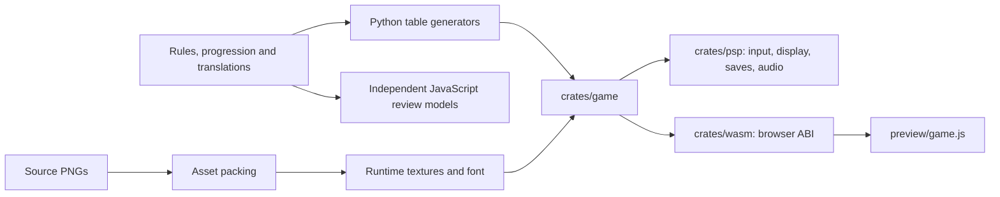

# Architecture

Sky Hopper separates gameplay and drawing from platform I/O. The same Rust
core is linked into the PSP executable and WASM preview. The JavaScript review
models are a separate design aid and cannot verify native behavior.

## Simulation and modes

`crates/game` uses `no_std` with `alloc`, so its logic works without a desktop
runtime. `Game::step` advances a fixed **1/60 second** step. The PSP adapter
accumulates elapsed time and advances the core; drawing frequency depends on
the device. The browser adapter follows the same shared core interface.

Modes are Menu, Playing, Paused, GameOver, Shop, Help and Journal. Edge-triggered
inputs handle jumps, purchases and menu actions; held input steers and controls
flight. The runner moves automatically to the right. Platform generation is
seeded, climbs diagonally and adds coins, pickups and hazards. Restart changes
the seed using accumulated run count, varying the route between attempts.

Movement includes a second jump, a short coyote margin after a ledge, a jump
buffer, dash and platform-specific interactions. World time can slow while
player motion remains responsive. Pausing freezes the simulation and timers.

## Rendering

`Screen` draws into a 480 × 272 RGBA8888 software framebuffer. It uses embedded
textures, an authored 5 × 7 bitmap font, clipping and alpha blending. World
coordinates are transformed by `WORLD_ZOOM = 0.8`; UI remains at native scale.
The sky is sampled with continuous ping-pong scrolling, particles and sprite
poses animate, and unlocked styles recolor the existing graphics.

The PSP adapter copies visible rows into a framebuffer with **512-pixel
stride**, then swaps buffers at vblank. The WASM wrapper exposes pixels for
the browser canvas. Native screenshots read the emulated PSP framebuffer.

Score and coins have small top cards; dash and active bonuses use a second
row. Each bonus card contains an icon, its timer and progress bar. Countdown
warnings appear near expiry. The pause page gives readable bonus names and
precise times without covering gameplay during a run.

## Bonus rules

`PowerState` stores six independent timer/duration pairs. Collecting a
compatible bonus keeps the others. Collecting the same bonus refreshes its
own duration; it does not accumulate infinite time.

| Interaction | Result |
| --- | --- |
| Magnet, shield, super jump and slow motion | Can coexist with compatible effects |
| Boost ↔ jetpack | New pickup replaces the other movement mode |
| Super jump during jetpack | Preserved; its timer waits and resumes after flight |
| Hit with shield | Consumes shield only |
| Hit protected by boost | Does not consume an independently active shield |

Duration upgrades are individual, up to three levels. The original global
duration purchase remains valid after migration. The JSON compatibility source
is compiled into `power_rules.rs`; interaction behavior lives in `powers.rs`
and `Game::activate_power`.

## Permanent progression

`Progress` stores best score, wallet, cosmetic ownership, equipped style,
upgrades, stocks, language, run totals, mission progress and relic collection.
The hangar has upgrades, supplies and style categories. Upgrade prices rise
by level; capsules accumulate up to their stock cap. One armed capsule is
consumed at the beginning of a run. Cosmetics are toggled once owned.

Three missions track distance, coins and pickups across attempts. Completion
adds wallet rewards, advances a tier and can unlock a collection badge.
The next mission varies through tiered targets. Coins and rewards are banked
when a run ends or the player returns from pause to the menu.

## Persistence and platform adapters

The current save has **32 unsigned values**, with stable keys in `SAVE_KEYS`.
`Progress::from_words` also accepts the original six-value layout, preserving
record, wallet, ownership, equipped styles and the legacy duration purchase.
Normalization bounds levels/stocks and rejects an armed empty capsule.

PSP persistence uses the SDK RCFG format in `sky-hopper-save.bin`: an RCFG
header, version/count, typed key-value entries and little-endian U32 values.
The adapter saves when the core marks progress dirty. Browser persistence uses
the WASM save exports and local storage. Review models have a separate storage
key and must not overwrite actual game progress.

`crates/psp/src/audio.rs` synthesizes music and events on a separate thread.
The browser wrapper synthesizes audio using Web Audio. There are no external
music files. Neither target requires an account or game network service.
