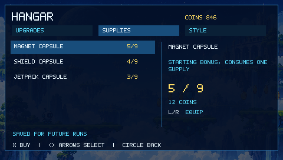
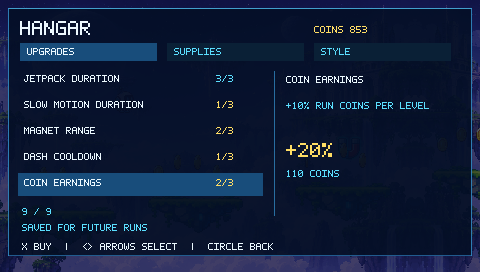
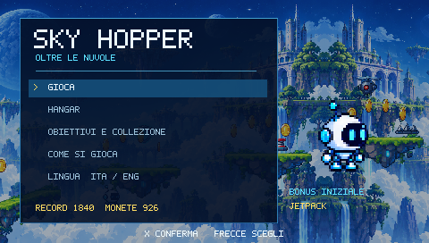
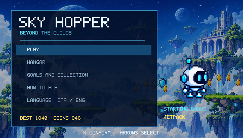
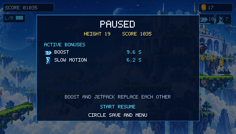
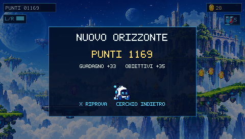

# Sky Hopper PSP — vetrina / showcase

Nuove schermate dell'**8 ottobre 2026**, catturate dalla build **PSP 0.2** in
PPSSPP 1.20.4. Il gameplay usa la panoramica all'80% e il nuovo HUD compatto.
Le immagini del gioco sono framebuffer reali a **480 × 272**, senza ritocchi.
La copertina e la galleria aggiungono una composizione esterna alle schermate.

Le catture usano un **salvataggio dimostrativo isolato** con monete, livelli,
capsule e oggetti sbloccati predisposti per mostrare le funzioni. Raccolte,
countdown, corse e risultati provengono dal gioco in esecuzione.

New captures of **PSP v0.2**, running in PPSSPP with an isolated demonstration
save. Resources and unlocks were staged; gameplay, pickups and run rewards are
actual game output. These are emulator captures, with native 480 × 272 pixels.

## Immagini per GitHub

| File | Dimensioni | Uso |
| --- | --- | --- |
| [cover.png](cover.png) | 1600 × 1000 | Copertina del README |
| [gallery.png](gallery.png) | 2080 px di larghezza | Vetrina con otto schermate |
| [social-preview.png](social-preview.png) | 1280 × 640 | Immagine di condivisione del repository |
| [GITHUB.md](GITHUB.md) | Markdown | Blocco da incollare nel README alla radice |

## Gameplay e progressione

| Gameplay · bonus simultanei | Nebula · interfaccia italiana |
| --- | --- |
|  |  |

| Hangar · livelli permanenti | Scorte · capsule accumulabili |
| --- | --- |
|  |  |

| Migliorie · guadagno monete | Obiettivi · collezione |
| --- | --- |
|  |  |

| ITA | ENG |
| --- | --- |
|  |  |

| Pausa · dettagli dei bonus | Fine corsa · ricompense |
| --- | --- |
|  |  |

Altre catture native: [panoramica](gameplay-panorama.png),
[boost e slow motion](gameplay-boost-slow-eng.png),
[migliorie ITA](hangar-migliorie-ita.png), [capsule ITA](hangar-capsule-ita.png),
[stile ITA](hangar-stile-ita.png), [stile ENG](hangar-style-eng.png),
[obiettivi ITA](obiettivi-ita.png), [pausa ITA](pausa-ita.png).

## Provenienza

La build non è stata ricompilata per queste immagini. SHA-256 dell'EBOOT:
`20578c2ad1bb01ac88ffbf5ca6e5e4e6c0a23f9f0d7af675f316b7b387ab42f8`.
Dettagli e hash delle immagini: [capture-manifest.json](capture-manifest.json).

`tools/capture_showcase.cjs --prepare` crea una copia della release e un profilo
dimostrativo in `.tools/github-showcase`. Con l'emulatore avviato su questa copia
e il debugger locale sulla porta 9234, lo script cattura i menu; `--play` cattura
una sequenza di gioco e `--extras` continua dalla pausa alle viste italiane.
I fotogrammi sono selezionati visivamente: il percorso cambia tra le esecuzioni.
`node tools/compose_showcase.cjs` ricrea copertina, galleria e social preview
dalle immagini selezionate. I salvataggi dimostrativi non fanno parte della
vetrina o del pacchetto del gioco.
